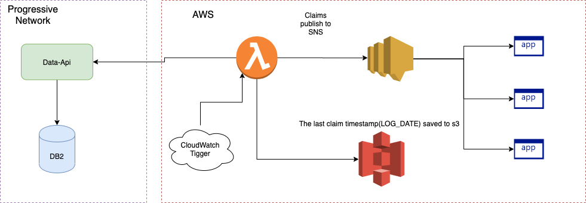

# Near Real Time Claims SNS
The purpose of Near-Real-Time Claims SNS is to notify Data Science applications that a claim was generated in the system.

## Work Completed or in Progress

**Data-api:**
A new API for retrieving claims from DB2. (Completed)

**AWS Lambda Claim Retrieving Function:**
The Lambda Function retrieves new claims by calling API and then publishes data to AWS Simple Notification System(SNS). The Lambda function is trigger by AWS CloudWatch event. (Completed)

**New AWS stack:**
A new AWS stack for deploy Lambda application to AWS account.

Components:

* Lambda function 
* SNS
* CloudWatch trigger
* s3 Storage

## Diagram:

## Future Changes
As the company moved to a more distributed and event-based architecture, the intention would be that the AWS SNS component would remain the same. The Lambda function and Data-api would be removed, and the SNS would be connected directly to an event topic.